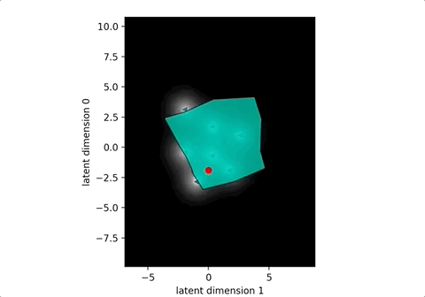

## inbetweens



中割り実験用のベジエ曲線モーフィングツールです。SIGGRAPH で2014年に発表された以下の論文を参考にしています。

* [Learning a Manifold of Fonts](http://vecg.cs.ucl.ac.uk/Projects/projects_fonts/projects_fonts.html) - Neill D.F. Campbell and Jan Kautz.

BSD like license で配布されている [Roto++](https://github.com/vinben/Rotopp) の generalized Procrustes analysis (RigidMotionEstimator) の C++ コードを使用しています。


### インストール (WIP)

`virtualenv` 環境を用意し、必要なライブラリをインストールします。

```sh
$ pip install -r requirements.txt
```

[pybind11](https://github.com/pybind/pybind11) をインストールし generalized Procrustes analysis 用モジュールをコンパイルします。ライブラリのパス等は適宜修正してください。

```sh
$ ./build.sh
```

### 動作方法

```sh
$ python morphing.py
```

SVG からパスを抽出し matplotlib 上で変形操作を試すことができます。画面をクリックして、キーボードの `1` - `7` を入力すると元の図形が表示されます。

`m` を入力すると変形画面が表示されます。グラフ上をクリックすると赤い点が表示され、その点での変形図形が描画されます。
